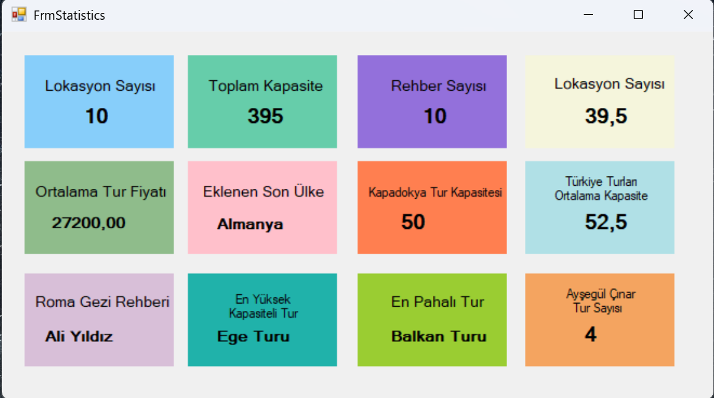

Bu proje Murat Yücedağ C# Eğitim Kampı kapsamında geliştirilmiş bir Windows Forms uygulamasıdır. Proje, bir tur şirketine ait veritabanından çeşitli istatistiksel verileri çekerek kullanıcı arayüzünde görselleştirmeyi amaçlamaktadır.

## 🚀 Projede Neler Öğrendim?

### ⭐ Entity Framework ile Veritabanı Yönetimi
- **Entity Framework** kullanarak veritabanına bağlanmayı ve `DbContext` üzerinden tablolarla çalışmayı öğrendim.  
- Veritabanından veri çekme, ekleme, güncelleme ve silme işlemlerini **LINQ** sorgularıyla nasıl gerçekleştirebileceğimi deneyimledim.

### ⭐ LINQ Sorgularını Kullanma
- İstatistiksel verileri sorgulamak için şu yöntemleri kullandım:
  - `Count()`, `Sum()`, `Average()`, `Max()` ve `Where()` gibi LINQ fonksiyonları.
  - Filtrelenmiş ve dinamik verilerle çalışmayı öğrendim (örneğin, belirli bir şehre veya rehbere ait verileri sorgulama).

### ⭐ Windows Forms ile Görselleştirme
- Windows Forms uygulamasıyla kullanıcı dostu bir arayüz geliştirdim.
- Etiketler (`Label`) ve diğer bileşenlerle dinamik olarak güncellenen istatistiksel verileri görselleştirdim.

### ⭐ Form Yüklenirken Dinamik Veri Getirme
- `Load` etkinliği sayesinde, form açıldığında veritabanından otomatik olarak verilerin yüklenmesini sağladım.
- Kullanıcı müdahalesi olmadan, verilerin gerçek zamanlı olarak arayüzde görüntülenmesini sağladık.

### ⭐ Veri Analizi ve Çıkarım Yapma
- Gerçek bir yazılım projesinde veri analizi yapmayı deneyimledim. Örnekler:
  - En yüksek kapasiteli turu belirleme.
  - Belirli bir şehrin rehberinin adını getirme.
  - Ülkere ait turların ortalama kapasitesini hesaplama.
  - Son eklenen ülkeyi tespit etme
  - Türkiye’deki turların ortalama kapasitesini hesaplama
  - Belirli bir şehir için kapasite bilgilerini getirme.
  - Fiyat değerleri arasında maksimum değeri getirerek ilgili turu belirleme.
  - Belirli bir rehbere atanmış tur sayısını bulma
  - Tüm turların ortalama fiyatını bulma
  - Toplam tur kapasitesini sorgulama
  - Lokasyon sayısını hesaplama

